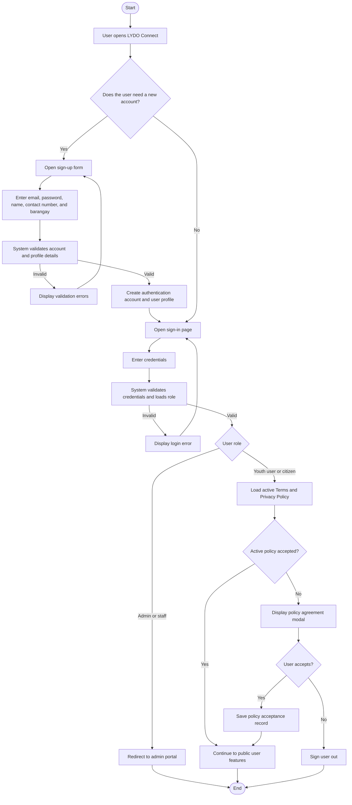
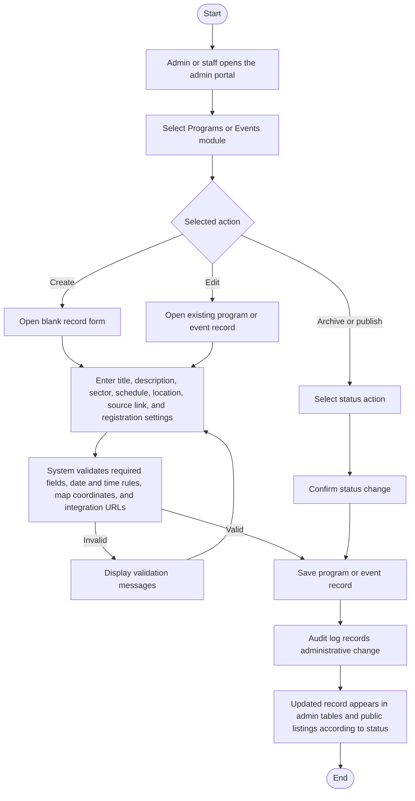
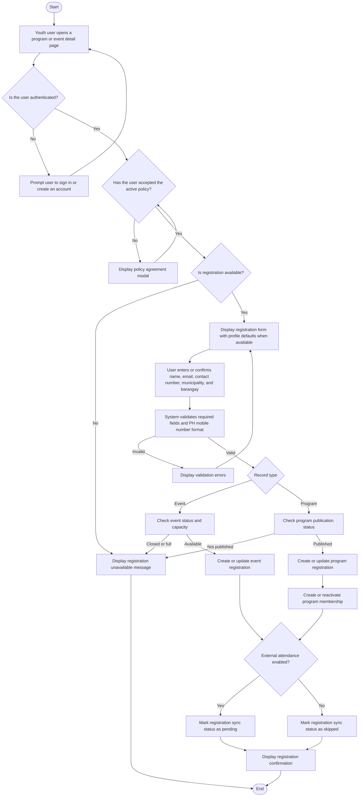
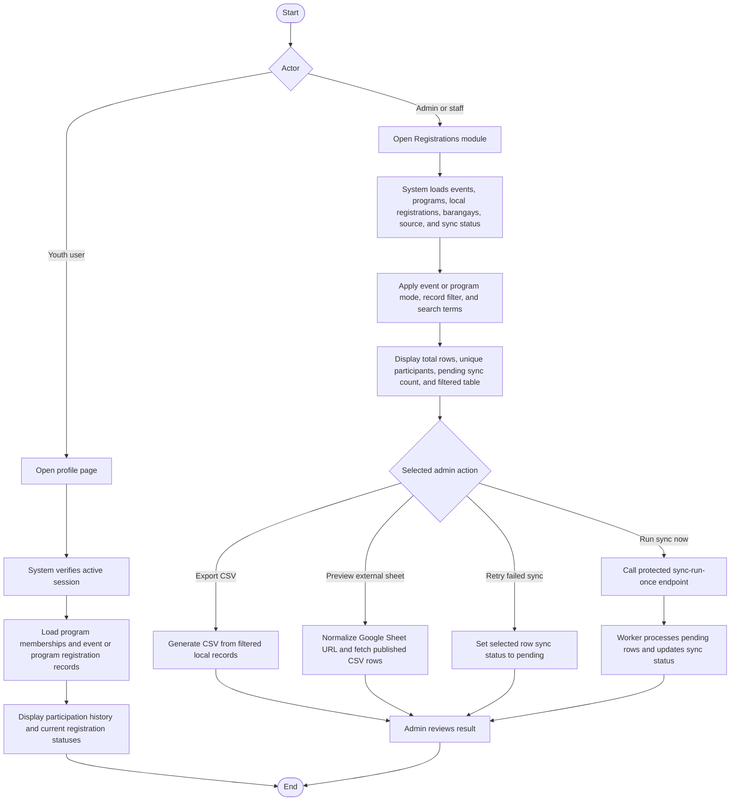
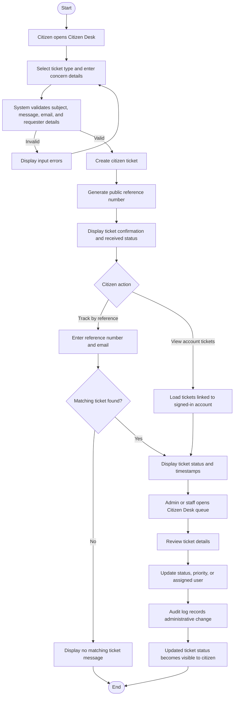
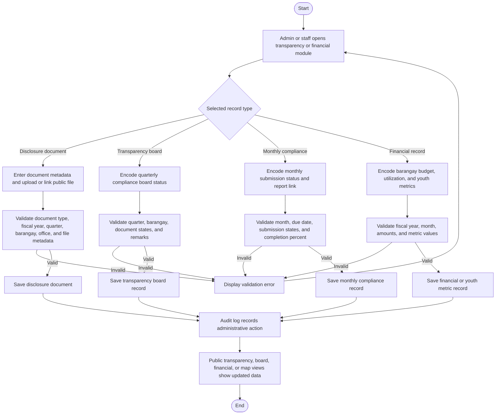
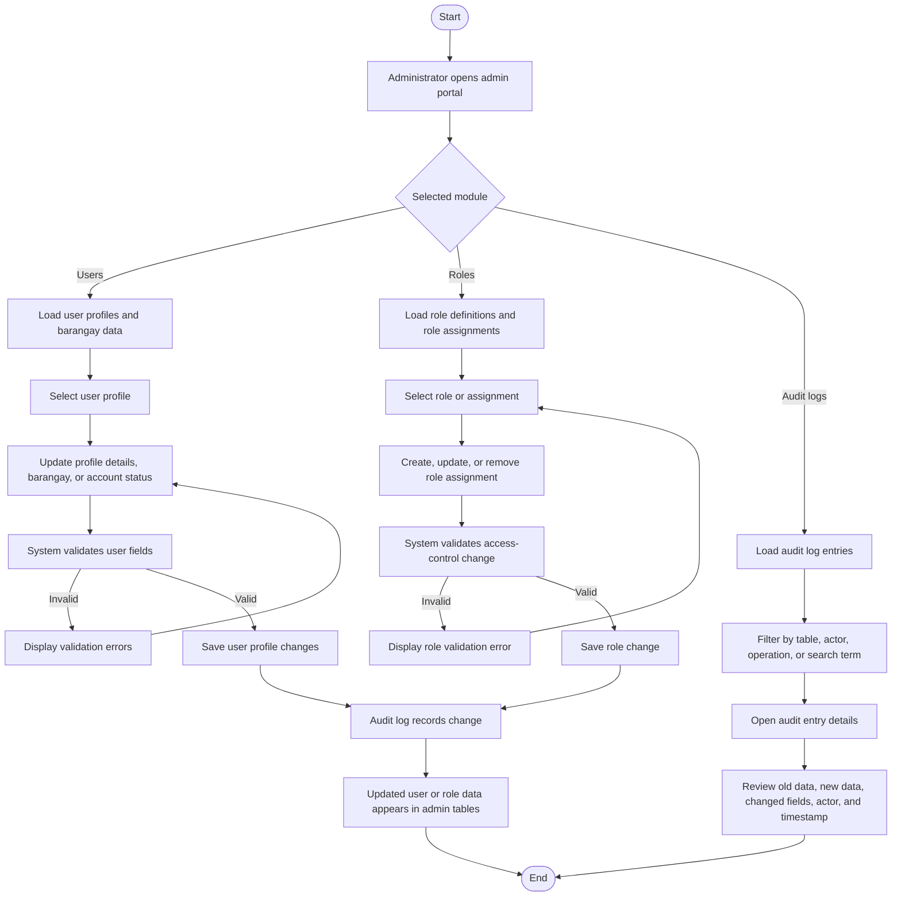

# 3.2.1 Activity Diagram

Activity diagrams show how the major LYDO Connect workflows proceed from one action to the next. The updated set groups the system into seven manuscript-level workflows: Account Registration / Login / Policy Agreement, Manage Programs and Events, Program or Event Registration, Participation Tracking / Registration Monitoring, Management of Service Requests / Citizen Desk, Transparency and Financial Records Management, and User, Role, and Audit Log Management.

## Figure 6.1. Activity Diagram of Account Registration / Login / Policy Agreement

## Figure 6.2. Activity Diagram of Manage Programs and Events

## Figure 6.3. Activity Diagram of Program or Event Registration

## Figure 6.4. Activity Diagram of Participation Tracking / Registration Monitoring

## Figure 6.5. Activity Diagram of Management of Service Requests / Citizen Desk

## Figure 6.6. Activity Diagram of Transparency and Financial Records Management

## Figure 6.7. Activity Diagram of User, Role, and Audit Log Management

## Interpretation

- The account workflow combines registration, login, role-based redirection, and active Terms of Service and Privacy Policy acceptance.
- The program and event management workflow covers admin creation, editing, publishing, archiving, scheduling, location, source, and registration-integration settings.
- The registration workflow stores participation in `event_registrations` or `program_registrations`, with sync status set according to external attendance settings.
- Participation tracking is user-facing through the profile page, while registration monitoring is admin-facing through filters, CSV export, external sheet preview, retry, and sync-run actions.
- The citizen desk workflow supports ticket submission, public tracking, account-linked ticket history, admin handling, and audit logging.
- Transparency and financial workflows cover documents, board records, monthly compliance, barangay financials, and youth metrics.
- User, role, and audit log management covers access administration and accountability review.
