# LYDO Connect Visual Site Map

This sitemap presents the app UI/page hierarchy in a visual tree format. It separates the User Interface / Public Portal from the Admin Interface.

Sources scanned:

- `src/App.tsx`
- `src/components/Navbar.tsx`
- `src/admin/AdminPortal.tsx`
- `src/admin/components/Sidebar.tsx`

## User Interface / Public Portal

```mermaid
%%{init: {"flowchart": {"htmlLabels": true, "nodeSpacing": 45, "rankSpacing": 60}, "theme": "base", "themeVariables": {"fontFamily": "Arial", "fontSize": "14px"}} }%%
flowchart TB
    Home["Home<br/>(/)"]:::home

    Auth["Login / Sign Up"]:::section
    Programs["Programs"]:::section
    Events["Events"]:::section
    Orgs["Organizations"]:::section
    Transparency["Transparency"]:::section
    Info["Information"]:::section
    Fallback["Fallback"]:::section

    Home --> Auth
    Home --> Programs
    Home --> Events
    Home --> Orgs
    Home --> Transparency
    Home --> Info
    Home --> Fallback

    Auth --> SignIn["Sign In<br/>(/signin)"]:::page
    Auth --> SignUp["Sign Up<br/>(/signup)"]:::page
    Auth --> Profile["Profile<br/>(/profile)"]:::page
    Auth --> Terms["Terms<br/>(/terms)"]:::page
    Auth --> Privacy["Privacy<br/>(/privacy)"]:::page
    Auth --> Policy["Policy Agreement<br/>Modal"]:::modal

    Programs --> ProgramList["Programs List<br/>(/programs)"]:::page
    Programs --> ProgramDetails["Program Details<br/>(/programs/:programId)"]:::page

    Events --> EventList["Events List<br/>(/events)"]:::page
    Events --> EventDetails["Event Details<br/>(/events/:eventId)"]:::page

    Orgs --> OrgList["Organizations<br/>(/organizations)"]:::page
    Orgs --> OrgInfo["Organization Info<br/>same page"]:::modal

    Transparency --> CitizenDesk["Citizen Desk<br/>(/feedback)"]:::page
    Transparency --> CitizenDeskAlias["Citizen Desk Alias<br/>(/transparency/citizen-desk)"]:::alias
    Transparency --> Reports["Disclosure Registry<br/>(/transparency/reports)"]:::page
    Transparency --> Board["Transparency Board<br/>(/transparency/board)"]:::page
    Transparency --> Financial["Financial Disclosure<br/>(/transparency/financial-disclosure)"]:::page
    Transparency --> BarangayMap["Barangay Map<br/>(/transparency/barangay-map)"]:::page

    Info --> About["About<br/>(/about)"]:::page
    Info --> Advocacy["Advocacy<br/>(/advocacy)"]:::alias

    Fallback --> NotFound["Not Found<br/>(*)"]:::page

    classDef home fill:#8bdcf4,stroke:#4aa8c0,stroke-width:1.5px,color:#0f172a;
    classDef section fill:#8de7d2,stroke:#45bfa7,stroke-width:1.5px,color:#0f172a;
    classDef page fill:#d7b4ff,stroke:#a477d6,stroke-width:1.2px,color:#24113d;
    classDef alias fill:#ffd78a,stroke:#d9a53e,stroke-width:1.2px,color:#33250b;
    classDef modal fill:#c9c8b8,stroke:#9b9a86,stroke-width:1.2px,color:#272720;
```

## Admin Interface

```mermaid
%%{init: {"flowchart": {"htmlLabels": true, "nodeSpacing": 45, "rankSpacing": 60}, "theme": "base", "themeVariables": {"fontFamily": "Arial", "fontSize": "14px"}} }%%
flowchart TB
    AdminLogin["Admin Login<br/>(/admin/signin)"]:::home
    AdminShell["Admin Portal<br/>(/admin)"]:::home

    AdminLogin --> AdminShell

    Overview["Overview"]:::section
    Youth["Youth Records"]:::section
    Transparency["Transparency"]:::section
    Administration["Administration"]:::section

    AdminShell --> Overview
    AdminShell --> Youth
    AdminShell --> Transparency
    AdminShell --> Administration

    Overview --> Dashboard["Dashboard<br/>tab: dashboard"]:::page

    Youth --> AdminPrograms["Programs<br/>tab: programs"]:::page
    Youth --> AdminEvents["Events<br/>tab: events"]:::page
    Youth --> Registrations["Registrations<br/>tab: registrations"]:::page
    Youth --> AdminOrgs["Organizations<br/>tab: organizations"]:::page
    Youth --> Barangays["Barangay Map Data<br/>tab: barangays"]:::page

    Transparency --> Docs["Transparency Docs<br/>tab: documents"]:::page
    Transparency --> BoardAdmin["Transparency Board<br/>tab: transparency-board"]:::page
    Transparency --> FinancialDss["Financial DSS<br/>tab: financial-dss"]:::page
    Transparency --> CitizenDeskAdmin["Citizen Desk<br/>tab: citizen-desk"]:::page

    Administration --> AuditLogs["Audit Logs<br/>tab: audit-logs"]:::page
    Administration --> Users["Users<br/>tab: users"]:::page
    Administration --> Roles["Roles & Permissions<br/>tab: roles"]:::page

    classDef home fill:#8bdcf4,stroke:#4aa8c0,stroke-width:1.5px,color:#0f172a;
    classDef section fill:#8de7d2,stroke:#45bfa7,stroke-width:1.5px,color:#0f172a;
    classDef page fill:#d7b4ff,stroke:#a477d6,stroke-width:1.2px,color:#24113d;
```

## Navigation Notes

- The public navbar starts from Home and links to Programs, Events, Organizations, Transparency, Sign In, Sign Up, and Profile.
- The Transparency menu contains Citizen Desk, Disclosure Registry, Transparency Board, Financial Disclosure, and Barangay Map.
- `/feedback` and `/transparency/citizen-desk` open the same Citizen Desk page.
- `/advocacy` opens the same page component as `/about`.
- `/events/:eventId` and `/programs/:programId` share the same detail/registration component.
- Admin modules are displayed as tabs inside `/admin`; they do not have separate browser route paths.
- The Terms and Privacy agreement after login is a modal gate, not a separate page route.
